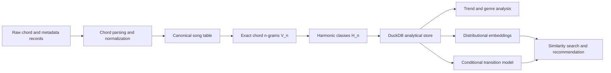
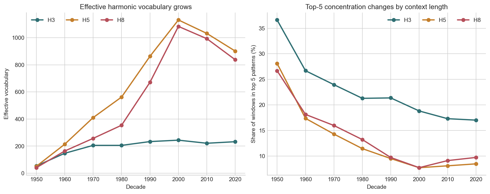
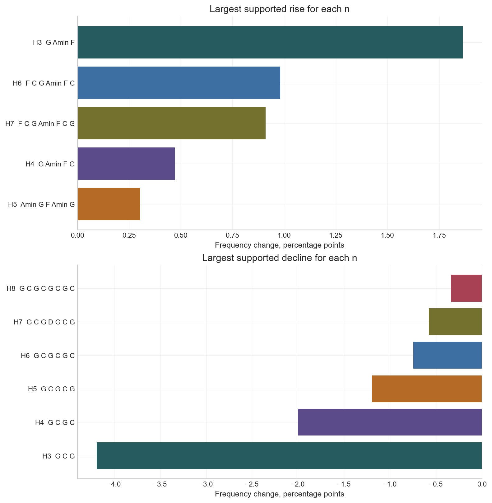
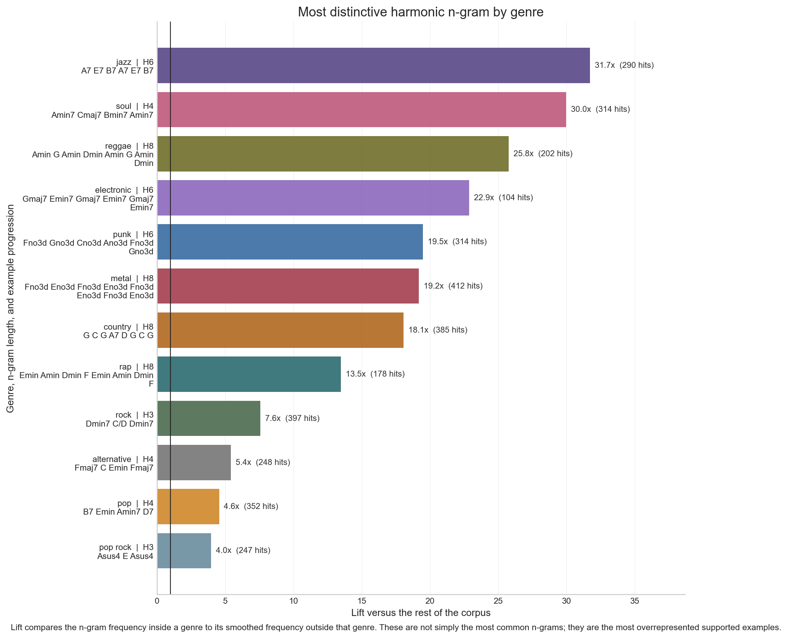
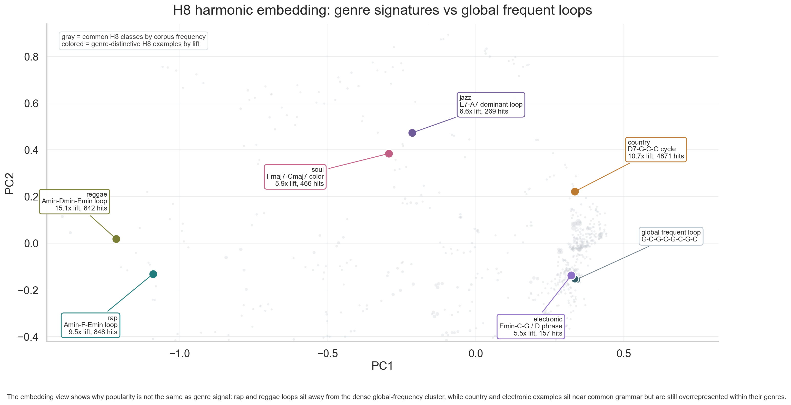

# Harmonic Trends

Musicians do not learn harmony as isolated chord names. They learn songs, notice
phrases that carry a feeling, remember the musical context around those phrases,
and reuse that vocabulary somewhere else. A songwriter might internalize the
pull of a dominant cycle, the mood of a minor loop, or the lift of a familiar
pop progression, then reshape it in a new key, genre, or arrangement.

This project builds the data foundation for a computer to do a version of that.
It takes messy chord-sequence data and turns it into a system that can recognize
harmonic phrases, compare how they are used, measure when they become
genre-specific, and prepare them for recommendation or prediction.

The guiding question:

> Can harmony be treated as a learnable vocabulary, then used to understand
> musical style, change over time, and recommend songs by how they move
> harmonically?

## What Is Built

This repository contains an end-to-end Python/Jupyter analysis pipeline that
treats chord progressions like a musical language. Raw chord strings are cleaned
into canonical song records, converted into exact chord `n`-grams, collapsed
into harmonic classes, and stored in DuckDB for repeatable analysis.

From there, the project asks five concrete questions:

- Which harmonic patterns become more or less common over time?
- Which patterns are common everywhere, but not very diagnostic?
- Which phrases are unusually characteristic of a genre?
- Which harmonic classes appear in similar song contexts?
- Can a current harmonic state help predict a likely next state?

The result is both a polished analysis project and a prototype data layer for
future harmonic recommendation. Instead of recommending only by artist, genre,
or audio surface, the system can compare songs by the harmonic vocabulary they
use.

## Why This Matters

Most music recommendation systems lean on metadata, listening behavior, audio
features, or artist similarity. Those signals are useful, but they often miss a
specific musical reason a listener likes something: the harmonic language.

If a listener likes the harmony of several artists, even across different
genres, this pipeline points toward a way to represent that taste directly. A
future system could say: this user tends to like songs built from these harmonic
phrases, in these contexts, with these kinds of continuations. That is the
foundation for recommendation, search, and style-conditioned inference.

## Project Highlights

- Cleaned noisy chord and metadata records into analysis-ready song tables.
- Designed harmonic `n`-gram features that preserve musical structure while
  allowing large-scale comparison.
- Built DuckDB-backed global counts, stratified counts, document-term tables,
  and exact-to-harmonic mappings.
- Reframed vague questions about musical "complexity" into measurable ideas:
  vocabulary size, concentration, specificity, change, and predictability.
- Produced readable findings about decade shifts, genre signatures, harmonic
  diversity, and recommendation use cases.
- Built distributional embeddings of harmonic classes from co-occurrence
  behavior, creating the basis for similarity search.
- Prototyped a conditional harmonic language model for predicting continuations
  from harmonic state plus metadata.

## Pipeline At A Glance



## What This Demonstrates

This repository is meant to show more than a set of charts. It demonstrates the
kind of end-to-end analytical work needed when the interesting signal is buried
inside messy, domain-specific data and has to be made measurable before it can
be modeled.

- **Data cleaning:** turning scraped chord strings and inconsistent metadata
  into a canonical dataset.
- **Feature engineering:** designing harmonic features that preserve musical
  meaning while making large-scale comparison possible.
- **Scalable analysis:** using chunked processing and DuckDB tables instead of
  one-off notebook state.
- **Statistical framing:** replacing vague claims about musical "complexity"
  with measurable quantities.
- **Communication:** converting technical outputs into readable findings,
  charts, and product-facing use cases.
- **Product thinking:** connecting the analysis to recommendation, retrieval,
  and inference systems.

## Tech Stack

- Python, Pandas, NumPy, DuckDB
- Jupyter notebooks for reproducible research
- Matplotlib for report-ready charts
- Sparse matrices, PPMI, SVD, and PCA for harmonic embeddings
- Count-based conditional language modeling for harmonic-state prediction

## Core Idea: Harmonic N-Grams

The core representation is the harmonic `n`-gram. This borrows from language
modeling: a song is a sequence, and short windows of that sequence become units
that can be counted, compared, embedded, and modeled.

There are two connected vocabularies:

- `V_n`: exact chord `n`-grams, such as the literal progression `G C G`.
- `H_n`: harmonic classes, where exact progressions are collapsed into
  normalized harmonic patterns.

This matters because a literal chord progression is often too specific. The same
harmonic idea can appear in different keys or surface spellings. By mapping
`V_n -> H_n`, the analysis studies harmonic behavior rather than only chord
labels. The fibers of that map are also useful: once many exact progressions map
to the same harmonic class, the analysis can ask which spellings realize that
class, which genres use it, and how its usage changes over time.

The project avoids treating "complexity" as a vague single score. Instead, it
breaks harmonic organization into measurable pieces:

- **Vocabulary size:** how many harmonic `n`-gram classes are active in a decade
  or genre.
- **Concentration:** whether usage is spread across many patterns or dominated
  by a small set of common patterns.
- **Specificity:** which harmonic patterns are unusually characteristic of a
  genre, decade, or artist.
- **Change over time:** which harmonic families rise, fall, or shift between
  decades.
- **Predictability:** how well the next harmonic state can be estimated from the
  current state and metadata.

Across sequence length, truncation maps such as `H_n -> H_{n-1}` make it
possible to ask how shorter harmonic contexts extend into longer phrases. That
is the prediction setup: given a remembered harmonic context, what continuations
are likely, and how does that answer change by genre, decade, or artist?

## Data Work

The raw input is not analysis-ready. It contains chord strings, section markers,
inconsistent metadata, missing values, repeated artists, sparse genre labels,
and intermediate tables that become too large for casual notebook work. A major
part of this project is turning that material into a reliable analytical store.

Key data steps:

- Download the Chordonomicon source data.
- Parse and normalize chord tokens, including enharmonic spelling, slash chords,
  section markers, and malformed tokens.
- Build a canonical song table with usable date, decade, artist, and genre
  fields.
- Stream chord sequences into exact `n`-gram counts without keeping every
  intermediate object in memory.
- Map exact progressions into harmonic classes using binary pitch-class
  representations.
- Persist outputs in DuckDB so later notebooks can query the same source of
  truth.

This is the main portfolio value of the project: the findings are only possible
because the messy musical source data was cleaned, normalized, structured, and
made queryable first.

## Findings

These findings come from the generated analysis tables. They are framed as
evidence-backed leads rather than sweeping claims about whether music is simply
becoming better, worse, simpler, or more complex. The more interesting story is
that harmonic vocabulary changes by context: some patterns are global grammar,
some are era markers, and some become genre signatures.

### Common does not always mean informative

The most frequent harmonic `n`-grams are often like the most frequent words in a
text corpus: real, important, and structurally necessary, but not always the
most diagnostic. In language, words like "the" or "and" carry less information
about document identity than more specific terms do. In this project, very
common harmonic loops can behave the same way.

The analysis therefore separates:

- **stop-gram-like patterns:** globally common harmonic material that appears
  across many songs, decades, and genres;
- **signature patterns:** harmonic families with high lift or TF-IDF in a
  particular genre, decade, or artist;
- **distributional neighbors:** harmonic classes that occur in similar song
  contexts, even if they are not the most frequent patterns overall.

This is why the project does not stop at a top-`n` frequency table. Frequency is
the starting point; specificity, context, and embeddings are where the musical
signal becomes useful.

### Harmonic vocabulary changes over time

The corpus does not point to a simple "more complex" or "less complex" story.
The effective harmonic vocabulary generally grows, but concentration also
changes: some decades use a broader vocabulary while still leaning heavily on a
small set of common patterns.



Read the two panels together. The upper panel tracks effective vocabulary size;
the lower panel tracks how much of each decade is covered by the five most
common patterns. This separates "more available harmonic patterns" from "more
evenly used harmonic patterns."

### Some harmonic families rise while older common loops decline

The strongest supported increases include modern common-pop progressions such
as `G Amin F` and longer variants of `F C G Amin`. The strongest declines include
older tonic-dominant loops such as `G C G`, `C G C`, and repeated `G C` patterns.



Each bar shows the largest supported frequency movement for a given `n`. The
point is not that one progression explains a decade, but that the pipeline can
surface musically interpretable candidates for follow-up analysis. If an `n`
value has no bar on one side, no candidate passed the current support filters
for that direction of change.

### Genre has a measurable harmonic signature

Genre differences are not only differences in instrumentation or production.
Some harmonic `n`-grams are strongly overrepresented inside a genre compared
with the rest of the corpus. This is a better signal than raw popularity: it
surfaces patterns that are characteristic of a genre, not merely common
everywhere.



Lift compares an `n`-gram's frequency inside a genre against its smoothed
frequency outside that genre. The chart shows the strongest supported example
for each genre, along with its `H_n` length and raw support count. This makes the
genre story concrete: jazz, soul, reggae, electronic, country, punk, metal, rap,
and pop-oriented genres surface different harmonic signatures rather than the
same global top patterns. The examples are meant to be read musically: rap
leans toward a repeating Amin-F-Emin shape, reggae toward Amin-G/Amin-Dmin
movement, country toward a D7-G-C-G cadence, and jazz toward dominant-seventh
cycling. Those are not claims that every song in the genre uses that exact
pattern; they are high-support examples of what the pipeline can recover when
it asks for harmonic vocabulary instead of only popular chords.

### Harmonic classes can be embedded by usage

The distributional embedding step treats each harmonic class like a term in a
musical corpus. Classes that appear in similar song contexts land near each
other in vector space, giving a basis for nearest-neighbor search,
recommendation, clustering, and style-conditioned inference.

The figure below zooms into `H8` because long-context harmonic phrases are
easier to read as musical examples. Gray points are common `H8` classes from the
corpus, the dark callout marks a globally frequent loop, and the colored
callouts mark genre-distinctive examples selected by lift. The point is that
raw popularity and genre signal are different things: a common loop can be
useful background grammar, while a rap Amin-F-Emin loop or a reggae
Amin-Dmin-Emin loop is more useful as harmonic vocabulary for a style.



Open the interactive version here: [H8 harmonic embedding explorer](docs/h8_harmonic_embedding_interactive.html).
It lets the reader hover over any point to inspect the full harmonic `n`-gram,
global support, and genre lift when the point is a signature example.

Explore the effect of changing window length here: [harmonic n-gram embedding explorer](docs/ngram_embedding_explorer.html).
This version lets the reader move from `H3` to `H8`, switch between song-level
and local co-occurrence context, and hover over each point to inspect the
example progression.

Explore likely continuations here: [harmonic continuation explorer](docs/harmonic_continuation_explorer.html).
This module makes the prediction story concrete: select a remembered harmonic
phrase, condition on the global corpus or a genre, and inspect the overlapping
phrases that most often follow.

This is the bridge to recommendation. A listener profile can be represented by
the harmonic neighborhoods it tends to prefer, then queried against songs or
artists with similar harmonic vocabularies. The embedding keeps broad
co-occurrence structure, while the genre lift analysis supplies interpretable
labels for why a recommendation might feel stylistically aligned.

## Stakeholders And Use Cases

This project is useful anywhere the harmonic vocabulary of a song matters, not
just its artist, genre tag, or audio surface.

- **Listeners and recommenders:** represent songs, artists, or users by the
  harmonic `n`-grams they use or enjoy. If a listener likes the harmony of
  artists A, B, and C, the system can recommend songs with similar harmonic
  vocabulary even across genre boundaries.
- **Songwriters and producers:** search for harmonic neighborhoods: songs that
  share a phrase shape, genres where a pattern is especially characteristic, or
  continuations that fit a given harmonic context.
- **Catalog and A&R teams:** compare artists, eras, and genres by harmonic
  vocabulary rather than only metadata labels.
- **Musicologists and analysts:** inspect how specific harmonic families rise,
  fall, cluster, or become genre-specific over time.
- **Inference systems:** estimate likely next harmonic states from a current
  context, optionally conditioned on decade, genre, or artist.

For recommendation specifically, the harmonic-vocabulary angle is the important
piece. A listener may enjoy the harmonic behavior of several artists even when
those artists sit in different genre buckets. A recommender built on this
pipeline could represent the listener's taste as a harmonic profile, then search
for songs with nearby harmonic profiles rather than only nearby metadata labels.

## Future Work

- Build a vector database for harmonic inference and recommendation. Store
  `H_n` embeddings, song-level harmonic profiles, artist profiles, genre
  centroids, and metadata filters in a searchable index.
- Add recommendation experiments: given seed songs or liked artists, retrieve
  harmonically similar songs and evaluate whether the results differ from
  genre-only or artist-only recommendation.
- Extend the conditional model from count-based transition tables to embedding
  aware smoothing, so sparse contexts can borrow information from nearby
  harmonic states.
- Make the projection/fiber structure explicit across lengths: study
  `H_n -> H_{n-1}` and, if introduced in the notebooks, generalized maps such as
  `G_n -> G_{n-1}`.
- Add uncertainty estimates for trend and genre-lift claims before treating
  findings as final.

## Repository Guide

- `notebooks/`: ordered notebooks for ingestion, cleaning, feature engineering,
  analysis, embeddings, and modeling.
- `notebooks/utils/`: reusable parsing, normalization, n-gram, DuckDB, and trend
  analysis helpers.
- `docs/assets/`: README charts generated from processed analysis outputs.
- `spaces/harmonic-trends/`: Hugging Face Static Space bundle for the
  interactive chart modules.
- `scripts/deploy_hf_space.py`: deployment helper for uploading the static
  Space with `huggingface_hub`.
- `requirements.txt`: minimal Python dependencies for running the notebooks.
- `data/`: ignored local data directory for raw downloads, DuckDB files, and
  generated outputs.

## Hugging Face Space Deployment

Live demo: [Harmonic Trends on Hugging Face Spaces](https://huggingface.co/spaces/juansalinas2/harmonic-trends).

The interactive modules are packaged as a Hugging Face Static Space in
`spaces/harmonic-trends/`. After creating a Hugging Face access token, deploy
with:

```bash
HF_TOKEN=... python3 scripts/deploy_hf_space.py --repo-id USERNAME/harmonic-trends
```

The deployment script creates the Space if needed, uploads the static bundle,
and prints the public Space URL.

## How To Reproduce The Analysis

Run the notebooks in order. Notebooks `00` and `01` prepare the source data; the
remaining notebooks build and analyze the harmonic vocabulary.

0. `notebooks/00_download_chordonomicon_dataset.ipynb`
   Downloads the Chordonomicon dataset into `data/raw/`.

1. `notebooks/01_build_canonical_dataset.ipynb`
   Normalizes the source data into a canonical song table for downstream
   analysis.

2. `notebooks/02_build_ngram_dataset.ipynb`
   Builds global exact and harmonic n-gram vocabularies, then writes `V_n`,
   `H_n`, `O_n`, and `bar O_n` directly into DuckDB.

3. `notebooks/03_build_frequency_objects.ipynb`
   Validates and inspects the global DuckDB store.

4. `notebooks/04_stratified_ngram_trends.ipynb`
   Tracks a small fixed set of globally common targets across year, decade, and
   genre.

5. `notebooks/05_analyze_stratified_trends.ipynb`
   Analyzes the target-limited trend tables from notebook 4.

6. `notebooks/06_interpret_harmonic_trends.ipynb`
   Turns target-limited trends into interpretable candidate findings.

7. `notebooks/07_build_harmonic_document_terms.ipynb`
   Builds the broader support-thresholded document-term table needed for
   corpus-linguistic statistics.

8. `notebooks/08_corpus_linguistic_occurrence_analysis.ipynb`
   Computes document frequency, stop-gram candidates, TF-IDF, entropy, and
   one-vs-rest enrichment.

9. `notebooks/09_ultimate_harmonic_eda.ipynb`
   Pulls the distilled outputs together into a report-style EDA: rising/falling
   harmonic families, diversity and concentration through time, genre vocabulary
   breadth, signature terms, regime shifts, and bounded artist-level vocabulary
   profiling.

10. `notebooks/10_harmonic_distributional_embeddings.ipynb`
   Builds distributional embeddings of harmonic `n`-gram classes from
   co-occurrence graphs: song/local context counts, PPMI matrices, SVD
   embeddings, nearest-neighbor inspection, structural-vs-distributional
   comparison, and genre centroids.

11. `notebooks/11_conditional_harmonic_language_modeling.ipynb`
    Builds an interpretable conditional language model over harmonic states:
    adjacent `H_n(t) -> H_n(t+1)` transitions, global/decade/genre/artist scoped
    counts, support-aware backoff interpolation, holdout evaluation, and
    style-conditioned continuation examples.

## Data

The `data/` directory is intentionally ignored by Git. The raw dataset,
intermediate DuckDB database, and generated CSV/NPZ outputs are produced by the
notebooks and can be rebuilt locally.

## Notebook Troubleshooting

- If a notebook imports the wrong `utils` module, restart the kernel and rerun from the top. Notebooks 2-8 now assert that they loaded utilities from this repository.
- If `duckdb` is missing, install the notebook dependencies with `python3 -m pip install -r requirements.txt` in the same interpreter used by the notebook kernel.
- If DuckDB reports a lock on `data/processed/harmonic_trends.duckdb`, stop/restart old Jupyter kernels that still have the database open, then rerun the notebook.
