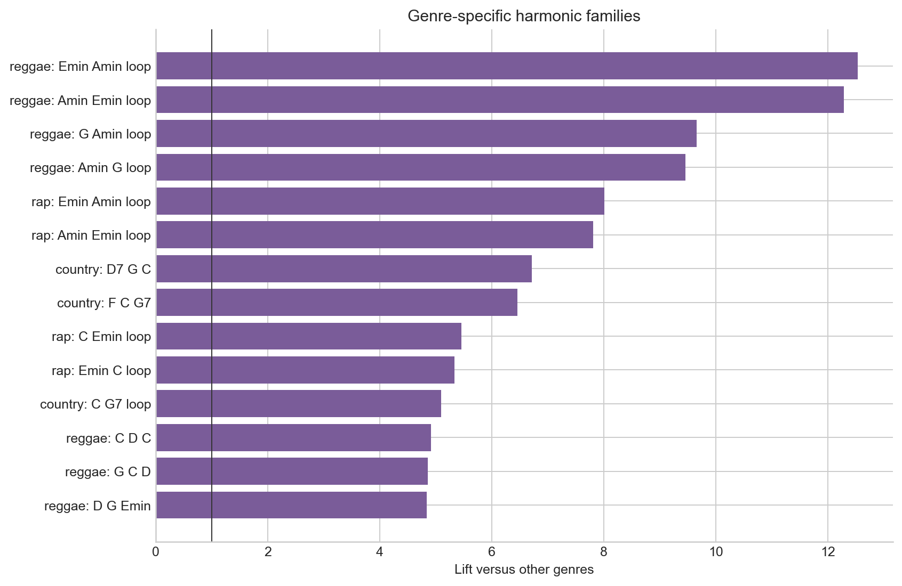

# harmonic-trends

An end-to-end data analysis project on harmonic language in popular music.

This project starts with messy chord-sequence data and turns it into a durable
analysis pipeline: raw data ingestion, chord normalization, harmonic feature
engineering, DuckDB-backed aggregation, trend analysis, distributional
embeddings, and a first-pass conditional language model. The goal is to show how
unstructured musical data can be cleaned, modeled, and turned into useful
evidence for search, recommendation, and inference.

The central question is:

> How has the harmonic vocabulary of popular music changed across time and
> genre, and can that vocabulary support recommendation or prediction?

## Project Highlights

- Built a reproducible Python/Jupyter pipeline from raw Chordonomicon data to
  analysis-ready tables.
- Normalized chord strings into comparable harmonic representations instead of
  relying only on literal chord spelling or key.
- Constructed exact chord `n`-gram vocabularies and collapsed them into
  transposition-normalized harmonic classes.
- Stored global counts, metadata-stratified counts, document-term tables, and
  exact-to-harmonic mappings in DuckDB.
- Produced interpretable findings about decade shifts, genre signatures,
  harmonic diversity, and concentration.
- Built distributional embeddings of harmonic classes from co-occurrence
  behavior, creating the basis for similarity search and recommendation.
- Prototyped a conditional model for predicting the next harmonic state from the
  current state plus metadata such as decade, genre, or artist.

## What This Demonstrates

This repository is meant to show more than a set of charts. It demonstrates the
kind of end-to-end analytical work needed when the interesting signal is buried
inside messy, domain-specific data.

- **Data cleaning:** turning scraped chord strings and inconsistent metadata
  into a canonical dataset.
- **Feature engineering:** designing harmonic features that preserve musical
  meaning while making large-scale comparison possible.
- **Scalable analysis:** using chunked processing and DuckDB tables instead of
  one-off notebook state.
- **Statistical framing:** replacing vague claims about musical "complexity"
  with measurable quantities.
- **Communication:** converting technical outputs into readable findings,
  charts, and product-facing use cases.
- **Product thinking:** connecting the analysis to recommendation, retrieval,
  and inference systems.

## Tech Stack

- Python, Pandas, NumPy, DuckDB
- Jupyter notebooks for reproducible research
- Matplotlib for report-ready charts
- Sparse matrices, PPMI, SVD, and PCA for harmonic embeddings
- Count-based conditional language modeling for harmonic-state prediction

## Why Harmonic N-Grams?

The core representation is the harmonic `n`-gram. This borrows from language
modeling: a song is a sequence, and short windows of that sequence become units
we can count, compare, embed, and model.

There are two connected vocabularies:

- `V_n`: exact chord `n`-grams, such as the literal progression `G C G`.
- `H_n`: harmonic classes, where exact progressions are collapsed into
  normalized harmonic patterns.

This matters because a literal chord progression is often too specific. The same
harmonic idea can appear in different keys or surface spellings. By mapping
`V_n -> H_n`, the analysis can study harmonic behavior rather than only chord
labels. The fibers of that map are also useful: for a harmonic class, we can ask
which exact progressions realize it, which genres use it, and how its usage
changes over time.

The project avoids treating "complexity" as a vague single score. Instead, it
breaks harmonic organization into measurable pieces:

- **Vocabulary size:** how many harmonic `n`-gram classes are active in a decade
  or genre.
- **Concentration:** whether usage is spread across many patterns or dominated
  by a small set of common patterns.
- **Specificity:** which harmonic patterns are unusually characteristic of a
  genre, decade, or artist.
- **Change over time:** which harmonic families rise, fall, or shift between
  decades.
- **Predictability:** how well the next harmonic state can be estimated from the
  current state and metadata.

Across sequence length, truncation maps such as `H_n -> H_{n-1}` let us ask how
shorter harmonic contexts extend into longer phrases. Those fibers are the basis
for prediction and for comparing harmonic organization across genres and eras.

## Data Work

The raw input is not analysis-ready. It includes chord strings, section markers,
metadata fields, missing values, repeated artists, sparse genres, and large
intermediate tables. The pipeline turns that into a reliable analytical store.

Key data steps:

- Download the Chordonomicon source data.
- Parse and normalize chord tokens, including enharmonic spelling, slash chords,
  section markers, and malformed tokens.
- Build a canonical song table with usable date, decade, artist, and genre
  fields.
- Stream chord sequences into exact `n`-gram counts without keeping every
  intermediate object in memory.
- Map exact progressions into harmonic classes using binary pitch-class
  representations.
- Persist outputs in DuckDB so later notebooks can query the same source of
  truth.

This is the main portfolio value of the project: it demonstrates the full path
from messy domain-specific data to a structured, reproducible analysis.

## Findings

These findings come from the generated analysis tables and are intended as
evidence-backed leads. The project favors careful measurable claims over broad
claims about whether music is simply becoming better, worse, simpler, or more
complex.

### Harmonic vocabulary changes over time

The corpus does not point to a simple "more complex" or "less complex" story.
The effective harmonic vocabulary generally grows, but concentration also
changes: some decades use a broader vocabulary while still leaning heavily on a
small set of common patterns.

### Some harmonic families rise while older common loops decline

The strongest supported increases include modern common-pop progressions such
as `G Amin F` and longer variants of `F C G Amin`. The strongest declines include
older tonic-dominant loops such as `G C G`, `C G C`, and repeated `G C` patterns.

### Genre has a measurable harmonic signature

Genre differences are not only differences in instrumentation or production.
Some harmonic families have high lift within specific genres compared with the
rest of the corpus. Country, reggae, rap, and other genres show different
signature families and different levels of concentration.

### Harmonic classes can be embedded by usage

The distributional embedding step treats each harmonic class like a term in a
musical corpus. Classes that appear in similar song contexts land near each
other in vector space, giving a basis for nearest-neighbor search,
recommendation, clustering, and style-conditioned inference.

## Why This Is Useful

This project is useful anywhere the harmonic vocabulary of a song matters, not
just its artist, genre tag, or audio surface.

- **Music recommendation:** represent songs, artists, or users by the harmonic
  `n`-grams they use or enjoy. If a listener likes the harmony of artists A, B,
  and C, the system can recommend songs with similar harmonic vocabulary even
  across genre boundaries.
- **Inference and prediction:** estimate likely next harmonic states from a
  current harmonic context, optionally conditioned on decade, genre, or artist.
- **Catalog analysis:** compare artists, genres, and eras by harmonic vocabulary
  rather than only metadata labels.
- **Musicological search:** find songs or genres that share a harmonic family,
  locate unusually genre-specific patterns, or inspect how a pattern changes
  over time.

For recommendation specifically, the harmonic-vocabulary angle is the important
piece. A listener may enjoy the harmonic behavior of several artists even when
those artists sit in different genre buckets. A recommender built on this
pipeline could represent the listener's taste as a harmonic profile, then search
for songs with nearby harmonic profiles rather than only nearby metadata labels.

## Future Work

- Build a vector database for harmonic inference and recommendation. Store
  `H_n` embeddings, song-level harmonic profiles, artist profiles, genre
  centroids, and metadata filters in a searchable index.
- Add recommendation experiments: given seed songs or liked artists, retrieve
  harmonically similar songs and evaluate whether the results differ from
  genre-only or artist-only recommendation.
- Extend the conditional model from count-based transition tables to embedding
  aware smoothing, so sparse contexts can borrow information from nearby
  harmonic states.
- Make the projection/fiber structure explicit across lengths: study
  `H_n -> H_{n-1}` and, if introduced in the notebooks, generalized maps such as
  `G_n -> G_{n-1}`.
- Add uncertainty estimates for trend and genre-lift claims before treating
  findings as final.

## Repository Structure

- `notebooks/`: ordered notebooks for ingestion, cleaning, feature engineering,
  analysis, embeddings, and modeling.
- `notebooks/utils/`: reusable parsing, normalization, n-gram, DuckDB, and trend
  analysis helpers.
- `docs/assets/`: README charts generated from processed analysis outputs.
- `requirements.txt`: minimal Python dependencies for running the notebooks.
- `data/`: ignored local data directory for raw downloads, DuckDB files, and
  generated outputs.

## Notebook Pipeline

Run the notebooks in order. Notebooks `00` and `01` prepare the source data; the
remaining notebooks build and analyze the harmonic vocabulary.

0. `notebooks/00_download_chordonomicon_dataset.ipynb`
   Downloads the Chordonomicon dataset into `data/raw/`.

1. `notebooks/01_build_canonical_dataset.ipynb`
   Normalizes the source data into a canonical song table for downstream analysis.

2. `notebooks/02_build_ngram_dataset.ipynb`
   Builds global exact and harmonic n-gram vocabularies, then writes `V_n`, `H_n`, `O_n`, and `bar O_n` directly into DuckDB.

3. `notebooks/03_build_frequency_objects.ipynb`
   Validates and inspects the global DuckDB store.

4. `notebooks/04_stratified_ngram_trends.ipynb`
   Tracks a small fixed set of globally common targets across year, decade, and genre.

5. `notebooks/05_analyze_stratified_trends.ipynb`
   Analyzes the target-limited trend tables from notebook 4.

6. `notebooks/06_interpret_harmonic_trends.ipynb`
   Turns target-limited trends into interpretable candidate findings.

7. `notebooks/07_build_harmonic_document_terms.ipynb`
   Builds the broader support-thresholded document-term table needed for corpus-linguistic statistics.

8. `notebooks/08_corpus_linguistic_occurrence_analysis.ipynb`
   Computes document frequency, stop-gram candidates, TF-IDF, entropy, and one-vs-rest enrichment.

9. `notebooks/09_ultimate_harmonic_eda.ipynb`
   Pulls the distilled outputs together into a report-style EDA: rising/falling harmonic families, diversity and concentration through time, genre vocabulary breadth, signature terms, regime shifts, and bounded artist-level vocabulary profiling.

10. `notebooks/10_harmonic_distributional_embeddings.ipynb`
   Builds distributional embeddings of harmonic `n`-gram classes from co-occurrence graphs: song/local context counts, PPMI matrices, SVD embeddings, nearest-neighbor inspection, structural-vs-distributional comparison, and genre centroids.

11. `notebooks/11_conditional_harmonic_language_modeling.ipynb`
    Builds an interpretable conditional language model over harmonic states: adjacent `H_n(t) -> H_n(t+1)` transitions, global/decade/genre/artist scoped counts, support-aware backoff interpolation, holdout evaluation, and style-conditioned continuation examples.

## Data

The `data/` directory is intentionally ignored by Git. The raw dataset,
intermediate DuckDB database, and generated CSV/NPZ outputs are produced by the
notebooks and can be rebuilt locally.

## Notebook Troubleshooting

- If a notebook imports the wrong `utils` module, restart the kernel and rerun from the top. Notebooks 2-8 now assert that they loaded utilities from this repository.
- If `duckdb` is missing, install the notebook dependencies with `python3 -m pip install -r requirements.txt` in the same interpreter used by the notebook kernel.
- If DuckDB reports a lock on `data/processed/harmonic_trends.duckdb`, stop/restart old Jupyter kernels that still have the database open, then rerun the notebook.
