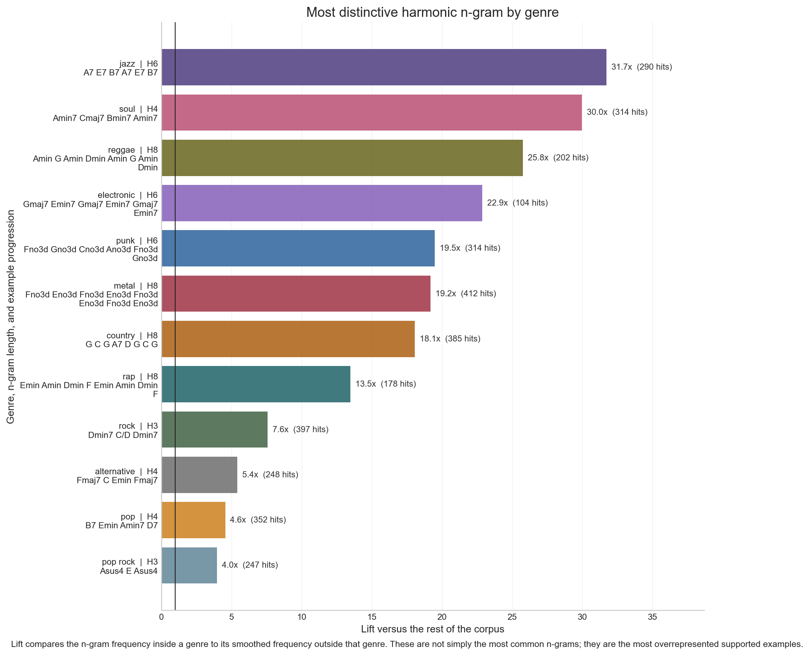

# Harmonic Trends

**Can chord progressions alone reveal musical style?**

Yes—but only part of it. Harmonic Trends turns 679,807 song-level chord
sequences into key-invariant features, tests them on unseen artists, and uses
them to power an explainable song-similarity explorer.

[**Try the live explorer**](https://huggingface.co/spaces/juansalinas2/harmonic-trends-explorer)
· [View the benchmark](notebooks/13_genre_decade_classification_benchmark.ipynb)
· [Read the visual analysis](notebooks/09_ultimate_harmonic_eda.ipynb)

## Project success

| Goal | Evidence | Status |
|---|---|:---:|
| Learn patterns that generalize beyond known artists | Key-invariant features beat literal chord trigrams on genre and decade prediction | **Passed** |
| Turn the research into a usable product | 679K songs indexed in a deployed similarity explorer | **Shipped** |
| Keep recommendations interpretable | Every match shows its shared harmonic features | **Shipped** |
| Make the analysis reproducible | Ordered notebooks rebuild the data, features, evaluation, and search index | **Complete** |

## Main result

The controlled benchmark changes only the feature representation. Both models
use the same songs, artist-held-out split, TF-IDF weighting, and linear
classifier.

| Metric | Literal chords | Key-invariant harmony | Change |
|---|---:|---:|---:|
| Genre macro-F1 | 0.185 | **0.205** | +0.020 |
| Genre top-3 accuracy | 43.3% | **46.4%** | +3.1 pp |
| Decade macro-F1 | 0.205 | **0.219** | +0.014 |
| Decade top-3 accuracy | 55.5% | **57.6%** | +2.1 pp |
| Decade mean absolute error | 1.96 decades | **1.85 decades** | −0.11 |

**Conclusion:** transposition invariance produces a modest but consistent gain
on unseen artists. Harmony contains useful genre and era signal, but it is not
a complete description of either.

## Findings

1. **The same progression should count as the same pattern in every key.**
   Collapsing transposed phrases improves every reported benchmark metric.
2. **Distinctive is more useful than popular.** Genre lift reveals characteristic
   patterns that raw frequency hides, including different signatures for jazz,
   reggae, country, metal, rap, and pop-oriented genres.
3. **Harmonic change is not a simple complexity trend.** Vocabulary size and
   concentration move differently across decades: a period can use more patterns
   while still depending on a small common core.
4. **Similar harmonic usage creates useful neighborhoods.** Co-occurrence
   embeddings group patterns used in similar song contexts, while the deployed
   search index retrieves songs by shared `H3`–`H8` features.



## How it works

```text
raw songs → cleaned chord sequences → key-invariant H3–H8 features
          → analysis + held-out evaluation + similarity search
```

- **Data:** 679,807 songs, 91,556 artists, 12 broad genres, 1899–2023
- **Storage:** DuckDB and Parquet
- **Modeling:** TF-IDF, linear classification, PPMI/SVD, cosine similarity
- **Product:** Python HTTP server and vanilla JavaScript

## Reproduce it

```bash
python3 -m venv .venv
source .venv/bin/activate
python3 -m pip install -r requirements.txt
jupyter lab
```

Run notebooks `00`–`13` in order. Notebook `00` downloads the source data;
later notebooks build the local DuckDB artifacts. To launch the explorer after
notebook `12` builds its index:

```bash
python3 app.py
```

Open `http://127.0.0.1:8000`.

## Where to look

| Need | Location |
|---|---|
| Evaluated result | [Notebook 13](notebooks/13_genre_decade_classification_benchmark.ipynb) |
| Visual findings | [Notebook 09](notebooks/09_ultimate_harmonic_eda.ipynb) |
| Similarity index | [Notebook 12](notebooks/12_build_song_harmonic_similarity_index.ipynb) |
| Distributional embeddings | [Notebook 10](notebooks/10_harmonic_distributional_embeddings.ipynb) |
| Reusable pipeline code | [`notebooks/utils/`](notebooks/utils/) |
| Web application | [`app.py`](app.py) and [`static/`](static/) |

## Limitations

- Genre labels are broad and assigned at the artist level.
- The benchmark is sampled for laptop-friendly runtime.
- Published Chordonomicon results are not directly comparable until their exact
  evaluation protocol is reproduced.

## Data source

Built from the
[Chordonomicon dataset](https://github.com/spyroskantarelis/chordonomicon) and
its [paper](https://arxiv.org/abs/2410.22046). Raw data and generated databases
stay outside Git and can be rebuilt from the notebooks.
