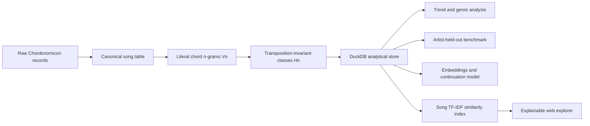
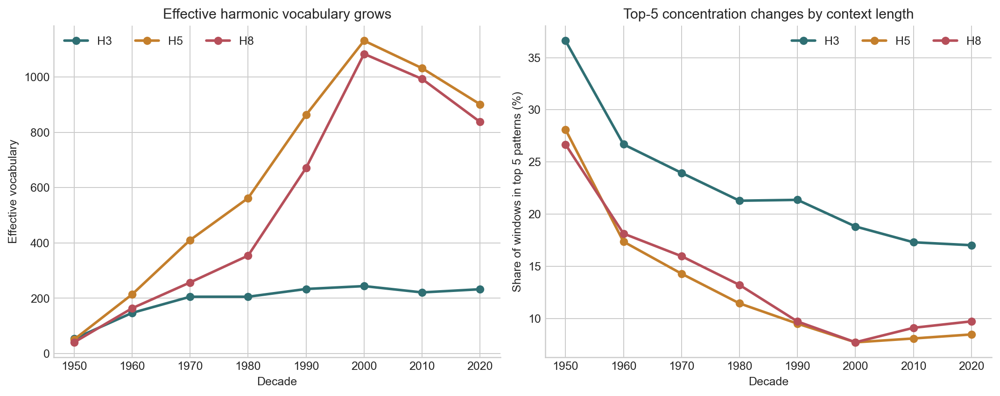
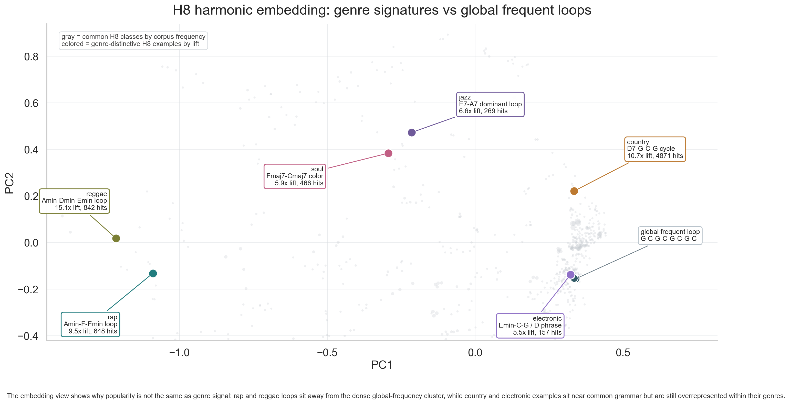

# Harmonic Trends

**An end-to-end data science system for learning musical style from chord
progressions.**

Harmonic Trends turns 679,807 noisy song-level chord sequences into
transposition-invariant features, validates those features with artist-held-out
classification, and serves explainable song similarity through a DuckDB-backed
web app.

[**Open the live explorer**](https://huggingface.co/spaces/juansalinas2/harmonic-trends-explorer)
· [Start with the benchmark](notebooks/13_genre_decade_classification_benchmark.ipynb)
· [Read the visual analysis](notebooks/09_ultimate_harmonic_eda.ipynb)

## Why this project

Music recommenders usually rely on metadata, listening behavior, or audio
surface. This project asks a narrower question:

> Can the harmonic movement inside a song become a useful, interpretable
> representation of musical style?

The system treats chord progressions like language. Short chord windows become
`n`-grams that can be counted, normalized across keys, embedded, classified,
and used to retrieve harmonically similar songs.

| Project scope | Result |
|---|---:|
| Songs | 679,807 |
| Artists | 91,556 |
| Broad genre labels | 12 |
| Release years | 1899–2023 |
| Harmonic classes (`H3`–`H8`) | 20.7M |
| Indexed song-feature rows | 67.0M |

## Validated result

The main evaluation compares literal chord trigrams with transposition-invariant
harmonic trigrams. Both representations use the same songs, artist-held-out
split, TF-IDF weighting, and linear classifier; only the representation changes.

| Task and metric | Literal trigrams | Harmonic trigrams | Change |
|---|---:|---:|---:|
| Genre macro-F1 | 0.185 | **0.205** | +0.020 |
| Genre top-3 accuracy | 43.3% | **46.4%** | +3.1 pp |
| Decade macro-F1 | 0.205 | **0.219** | +0.014 |
| Decade top-3 accuracy | 55.5% | **57.6%** | +2.1 pp |
| Decade mean absolute error | 1.96 decades | **1.85 decades** | −0.11 |

The improvement is modest but consistent across both tasks. It supports the
representation hypothesis: collapsing transposed versions of the same phrase
helps a model generalize to unseen artists. The remaining error is also useful
evidence—harmony captures part of genre and era, not the entire signal.

The original Chordonomicon paper reports 26.6% genre accuracy and 40.3% decade
accuracy. Those numbers are context, not a direct comparison: this project uses
a sampled, artist-held-out split designed to prevent an artist's songs from
appearing in both training and test data. Reproducing the paper's exact protocol
is the next step before claiming an improvement over its benchmark.

## System design


```mermaid
flowchart LR
    A["Raw Chordonomicon records"] --> B["Canonical song table"]
    B --> C["Literal chord n-grams Vn"]
    C --> D["Transposition-invariant classes Hn"]
    D --> E["DuckDB analytical store"]
    E --> F["Trend and genre analysis"]
    E --> G["Artist-held-out benchmark"]
    E --> H["Embeddings and continuation model"]
    E --> I["Song TF-IDF similarity index"]
    I --> J["Explainable web explorer"]
```

The important modeling choice is the map from literal progressions (`V_n`) to
harmonic classes (`H_n`). For example, the same progression played in C or G
should share a representation. This removes key as a nuisance variable while
preserving the interval structure of the phrase.

## What is delivered

- **A reproducible data pipeline:** parses noisy chord strings, normalizes
  metadata, streams `n`-gram counts, and persists reusable tables in DuckDB.
- **A leakage-resistant benchmark:** evaluates genre and decade classification
  on artists the model did not see during training.
- **A visual analytical story:** measures harmonic vocabulary, concentration,
  genre specificity, and change over time.
- **Representation learning:** builds PPMI/SVD embeddings from harmonic
  co-occurrence and an interpretable continuation model.
- **A deployable retrieval product:** searches nearly 679K indexed songs and
  explains similarity through shared harmonic features.

## Explorer

The [Harmonic Trends Explorer](https://huggingface.co/spaces/juansalinas2/harmonic-trends-explorer)
turns the analysis into a product. It supports:

- song and artist search;
- nearest-neighbor retrieval across `H3`–`H8` features;
- genre, decade, and document-frequency filters;
- per-feature evidence showing why two songs are similar; and
- Spotify metadata when it is available.

The serving layer is deliberately small: Python's HTTP server, static
JavaScript, and a read-only DuckDB database. The database is both the learned
harmonic memory and the retrieval engine.

## Selected findings

### Genre signatures are different from global popularity

Lift surfaces phrases that are unusually common within a genre rather than
phrases that are common everywhere. The supported examples recover different
harmonic signatures for jazz, reggae, country, metal, rap, and pop-oriented
genres.


### Harmonic vocabulary changes without a simple “more complex” story

Effective vocabulary and concentration move differently over time. A decade
can use a broader set of patterns while still relying heavily on a small common
core.



### Similar usage creates useful harmonic neighborhoods

PPMI and truncated SVD place harmonic classes near others that occur in similar
song contexts. These neighborhoods provide the representation used for
exploration, style comparison, and future recommendation experiments.



Interactive companions:

- [Harmonic style lens](docs/h8_harmonic_embedding_interactive.html)
- [N-gram embedding explorer](docs/ngram_embedding_explorer.html)
- [Harmonic continuation explorer](docs/harmonic_continuation_explorer.html)

## Portfolio reading path

If you have ten minutes, read these notebooks in this order:

1. [13 — Classification benchmark](notebooks/13_genre_decade_classification_benchmark.ipynb):
   the evaluated result, confusion matrices, and model interpretation.
2. [09 — Harmonic EDA](notebooks/09_ultimate_harmonic_eda.ipynb):
   the report-ready analytical narrative.
3. [12 — Similarity index](notebooks/12_build_song_harmonic_similarity_index.ipynb):
   the data product behind the deployed explorer.
4. [10 — Distributional embeddings](notebooks/10_harmonic_distributional_embeddings.ipynb):
   the representation-learning extension.

## Notebook map

| Stage | Notebooks | Output |
|---|---|---|
| Acquire and clean | `00`–`01` | Raw download and canonical song table |
| Build features | `02`–`03` | Exact and harmonic `n`-gram vocabularies |
| Analyze trends | `04`–`09` | Trend tables, corpus statistics, and visual EDA |
| Learn representations | `10`–`11` | Embeddings and conditional continuations |
| Build the product | `12` | Song-level TF-IDF similarity index |
| Evaluate | `13` | Artist-held-out genre and decade benchmark |

Every notebook opens with a purpose, deliverable, and pipeline diagram. The
early notebooks emphasize reproducibility; the portfolio path above emphasizes
results.

## Run locally

```bash
python3 -m venv .venv
source .venv/bin/activate
python3 -m pip install -r requirements.txt
jupyter lab
```

Run notebooks `00` through `13` in order. The `data/` directory is intentionally
ignored by Git; notebook `00` downloads the source data and later notebooks
build the local DuckDB artifacts.

After notebook `12` creates the similarity index, launch the app:

```bash
python3 app.py
```

Then open `http://127.0.0.1:8000`.

## Repository structure

```text
harmonic-trends/
├── notebooks/          # ordered research and modeling workflow
│   └── utils/          # reusable parsing, feature, and DuckDB helpers
├── docs/               # charts and interactive analysis modules
├── static/             # explorer front end
├── scripts/            # database build, enrichment, and deployment tools
├── spaces/             # Hugging Face Space bundle
├── app.py              # DuckDB-backed application server
└── requirements.txt    # notebook dependencies
```

## Methods and tools

- **Data engineering:** Python, pandas, streaming aggregation, Parquet, DuckDB
- **Feature engineering:** literal chord `n`-grams and transposition-invariant
  harmonic classes from `H3` through `H8`
- **Statistics:** TF-IDF, lift, entropy, concentration, and temporal change
- **Machine learning:** sparse linear classification, PPMI, truncated SVD, PCA,
  cosine similarity, and support-aware transition models
- **Product:** Python HTTP server, vanilla JavaScript, Docker, Hugging Face Spaces

## Limitations and next experiment

- Genre labels are broad and attached at the artist level; harmony is only one
  component of genre identity.
- The benchmark is intentionally simple and sampled for laptop-friendly runtime.
- The next controlled experiment is to compare `H3` through `H8` on one fixed
  artist-held-out split, then reproduce the paper's evaluation protocol.

## Data source

The project uses the
[Chordonomicon dataset](https://github.com/spyroskantarelis/chordonomicon),
introduced in the
[Chordonomicon paper](https://arxiv.org/abs/2410.22046). Generated databases and
raw data remain outside Git and can be rebuilt from the notebooks.
